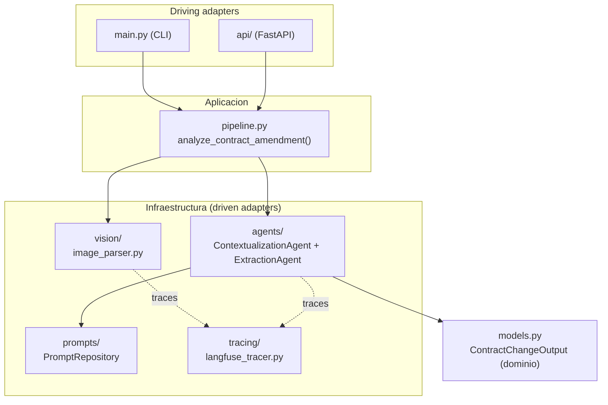
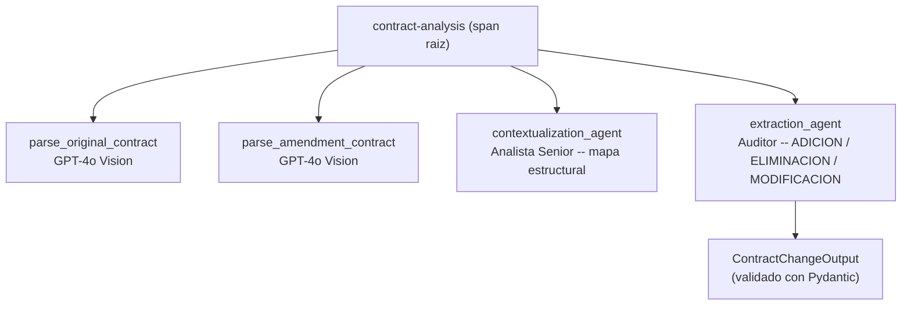

# Arquitectura

Hexagonal-lite: el dominio (`models.py`) y los entry points (`main.py`, `api/`) no dependen directamente de OpenAI ni de Langfuse — esos son detalles de infraestructura, reemplazables.



```text
src/
├── main.py                 # entry point CLI
├── models.py                # dominio -- ContractChangeOutput (Pydantic)
├── config.py                 # carga y validacion de variables de entorno
├── constants/                 # modelos de LLM y nombres de agentes, en un solo lugar
├── application/
│   └── pipeline.py             # orquesta el flujo completo + jerarquia de spans
├── infrastructure/
│   ├── vision/                  # cliente OpenAI + parsing de imagenes (GPT-4o Vision)
│   ├── agents/                   # ContextualizationAgent, ExtractionAgent
│   ├── prompts/                    # PromptRepository (prompts editables via API)
│   └── tracing/                     # cliente y callback handler de Langfuse
└── api/
    ├── health.py                    # GET /health
    ├── analysis.py                   # POST /analysis
    └── prompts.py                     # GET/PUT /prompts
```

## Cómo funciona el pipeline

`analyze_contract_amendment()` abre un span raíz `contract-analysis` en Langfuse y ejecuta, en orden:



1. **Parsing multimodal** (x2): GPT-4o Vision transcribe cada imagen fielmente (`temperature=0`, prohibido resumir o interpretar), preservando la jerarquía de cláusulas.
2. **ContextualizationAgent** (Agente 1, "Analista Legal Senior"): compara la estructura de ambos documentos y arma un mapa de correspondencias — no opina sobre qué cambió.
3. **ExtractionAgent** (Agente 2, "Auditor Legal"): usa ese mapa + los dos textos para identificar cada cambio, distinguiendo ADICIÓN / ELIMINACIÓN / MODIFICACIÓN, y devuelve el resultado ya validado (`llm.with_structured_output(ContractChangeOutput)`).

## Observabilidad (Langfuse)

Cada corrida del pipeline genera una traza con jerarquía completa (ver diagrama arriba) — inputs, outputs, tokens, latencia y costo por cada llamada a un LLM. Si el pipeline falla, tanto el span raíz como el span específico que falló quedan marcados en error, para poder auditar exactamente dónde ocurrió el problema.

`LANGFUSE_TRACING_ENVIRONMENT=agent-doc` en `.env` etiqueta todas las trazas de esta app, para poder filtrarlas en el dashboard si el mismo proyecto de Langfuse se comparte con otra aplicación.

## Decisiones técnicas (resumen)

- **Docker para desarrollo**: reproducibilidad total (misma app en cualquier máquina), con bind mounts para hot-reload — no se pierde velocidad de iteración por dockerizar.
- **Hexagonal-lite, no Clean Architecture completa**: el pipeline es de 4 pasos sin base de datos ni múltiples casos de uso — 4 anillos formales serían sobre-ingeniería. Se mantiene la idea central (el dominio no conoce los detalles externos) sin la ceremonia de interfaces formales por cada adapter.
- **Dos agentes con roles y prohibiciones explícitas**: "Analista Senior" (solo estructura) vs "Auditor" (solo cambios, con el mapa del primero como guía) — evita que se solapen o compitan por el mismo trabajo.
- **`with_structured_output(ContractChangeOutput)`** en vez de pedir JSON y parsearlo a mano: el modelo queda forzado por schema a devolver una instancia ya validada.
- **Anti-alucinación explícito en los prompts**: `temperature=0` en todas las llamadas, instrucciones contra resumir/interpretar/inventar, y una regla concreta encontrada probando con datos reales — que una cláusula no se repita en la enmienda no significa que fue eliminada (las enmiendas reales solo listan lo que cambia); solo se marca ELIMINACIÓN con lenguaje explícito de derogación.
- **Sin base de datos para los prompts editables**: son 2 strings, un archivo JSON alcanza — una DB sería sobre-ingeniería para este alcance.
